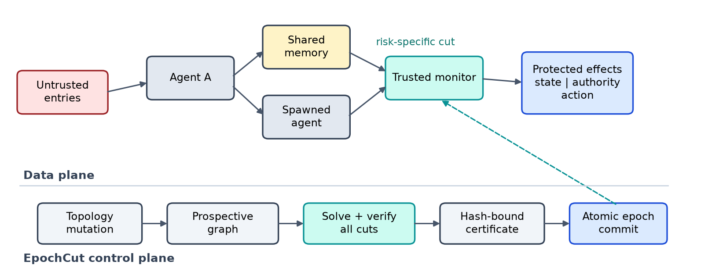

# EpochCut

**Verifiable attack-path closure for dynamic multi-agent LLM systems**

EpochCut is a research prototype that treats every runtime topology change as
a security transaction. Before a new agent, tool, memory, or communication
edge becomes live, EpochCut computes a minimum-cost monitor cut, independently
checks that the cut closes every declared source-to-effect path, and binds the
decision to the prospective graph with a SHA-256 closure certificate.



## Why this repository exists

Static defenses can become stale when an agent runtime changes after startup.
EpochCut focuses on that gap: complete mediation across *dynamic* influence
graphs. The repository contains the implementation, frozen protocols, raw
records, analysis code, MCP evaluation harness, manuscript source, and
machine-checkable artifact verifier used in the study.

EpochCut does not classify malicious text and is not a universal production
security guarantee. Its claim is conditional on complete graph reporting,
trusted enforcement points, and the tested deployment boundaries.

## Evidence snapshot

| Evaluation | Frozen evidence | Result | Interpretation |
|---|---:|---:|---|
| Dynamic graph runtime | 12,000 mutations; 6,000 adversarial | 0 unsafe EpochCut accepts; 88.7% lower configured monitor cost than full mediation; 1.622 ms p95 admission latency | All preregistered graph claim gates passed |
| Local MCP + three local LLMs | 126 paired trials; 45 attack trials per mode | Native committed 18 injected effects; EpochCut blocked 18/18 attempts and committed 0/45; benign exact completion 16/18 in both modes | All frozen local-MCP gates passed |
| Hosted MCP + NVIDIA Nemotron | 42 paired trials; 15 attack trials per mode | Native committed 3 injected effects; EpochCut blocked 3/3 and committed 0/15; benign exact completion 6/6 | Descriptive extension: the frozen native-opportunity gate required five attempts and did not pass |

The exact values and confidence intervals are in
[`results/analysis/confirmatory_analysis.json`](results/analysis/confirmatory_analysis.json),
[`results/mcp_confirmatory_v1/analysis/mcp_llm_analysis.json`](results/mcp_confirmatory_v1/analysis/mcp_llm_analysis.json),
and [`results/hosted_confirmatory_v3/analysis/hosted_mcp_llm_analysis.json`](results/hosted_confirmatory_v3/analysis/hosted_mcp_llm_analysis.json).

## Quick start

Prerequisite: Python 3.11 or newer.

```powershell
python -m venv .venv
.\.venv\Scripts\Activate.ps1
python -m pip install -e ".[dev]"
python examples/quickstart.py
python -m pytest -q
python scripts/verify_artifacts.py
```

On macOS or Linux, activate the environment with
`source .venv/bin/activate`. The quick-start program demonstrates an admitted
guarded mutation followed by a rejected unmonitorable bypass.

## Documentation

| Goal | Start here |
|---|---|
| Learn the system through a small example | [Getting started](docs/GETTING_STARTED.md) |
| Reproduce the graph, local-MCP, hosted-MCP, figures, and paper artifacts | [Reproducing results](docs/REPRODUCING_RESULTS.md) |
| Use the Python types and command-line scripts | [API reference](docs/API_REFERENCE.md) |
| Understand the model, invariants, trust boundary, and limitations | [Architecture](docs/ARCHITECTURE.md) |
| Inspect frozen protocols and study-specific decisions | [`docs/`](docs/) |
| Report a vulnerability or handle credentials safely | [Security policy](SECURITY.md) |

## Repository map

```text
epochcut/
|-- src/epochcut/       Core graph, cut, certificate, and intent-gate code
|-- examples/           Minimal executable walkthrough
|-- tests/              Unit and policy tests
|-- configs/            Frozen experimental protocols
|-- evaluation/         Persistent sandboxed MCP server
|-- scripts/            Experiment, analysis, figure, verification, packaging
|-- results/            Raw records, ledgers, transcripts, and analyses
|-- paper/              IEEE manuscript, bibliography, editable figures, PDF
`-- docs/               Protocols, results, readiness notes, and user guides
```

## Reproducibility levels

The repository deliberately separates three levels of verification:

1. `python -m pytest -q` checks implementation behavior.
2. `python scripts/verify_artifacts.py` checks required artifacts, frozen claim
   gates, and cryptographic bindings to raw evidence.
3. `scripts/package_repository.ps1` creates and fresh-extracts a clean project
   archive, then reruns the tests, quick start, and artifact verifier.

The local and hosted LLM evaluations have additional dependencies and runtime
requirements. Read [Reproducing results](docs/REPRODUCING_RESULTS.md) before
running them. Hosted runs can consume provider quota or paid tokens.

## Paper and citation

The compiled manuscript is [`paper/main.pdf`](paper/main.pdf), and the editable
LaTeX source is [`paper/main.tex`](paper/main.tex). Use
[`CITATION.cff`](CITATION.cff) for software and manuscript metadata.

## Contributing

Focused issues and pull requests are welcome. Before proposing a change, run
the test suite and artifact verifier. Do not overwrite frozen confirmatory
evidence; place exploratory outputs in `results/reproduction/` (ignored by
Git) or in a clearly labelled new directory. Security-sensitive reports
should follow [`SECURITY.md`](SECURITY.md).

## License status

No open-source reuse license has been selected yet. Copyright remains with the
authors; do not assume permission to redistribute or incorporate the code into
another project until a license is added.
