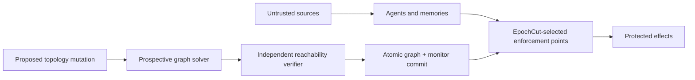

# Architecture

EpochCut is a control-plane mechanism for dynamic agent runtimes. It models
security-relevant influence rather than natural-language meaning.

The editable publication figure is
[`paper/figures/architecture.drawio`](../paper/figures/architecture.drawio).

## Core model

An `InfluenceGraph` contains typed nodes and directed, interface-labelled
edges. A `RiskPolicy` maps untrusted source kinds to protected sink kinds. For
each policy, EpochCut uses deterministic node splitting and Edmonds-Karp
max-flow to find a minimum-cost monitorable vertex cut.

Multiple policy cuts are unioned for activation. The union cost is compared to
an optional monitor budget. A canonical graph digest and the per-policy cut
are then bound into a closure certificate.

## Admission transaction

1. Copy the live graph.
2. Apply the proposed mutation only to the copy.
3. Solve a cut for every declared risk policy.
4. Independently remove the selected monitors and check reachability.
5. Reject if closure is impossible or the union exceeds budget.
6. Otherwise increment the epoch and atomically replace graph, monitors, and
   certificates.

A failure before step 6 leaves the live epoch unchanged. This ordering avoids
a window in which a new path is live before its enforcement point.

## Security invariants

- **Prospective closure:** admission is decided on the post-mutation graph.
- **Independent verification:** reachability is checked separately from the
  max-flow result.
- **Certificate binding:** graph, epoch, policy, monitors, and cost are hashed.
- **Fail-closed mutation:** an unmonitorable path or invalid edge is rejected.
- **Explicit effect intent:** the MCP adapter compares protected calls with a
  manifest; it does not infer safety from generated text.
- **Single-use commitment:** a matching protected intent can be consumed once.

## Trust boundary

The closure guarantee is conditional on deployment adapters reporting every
security-relevant node and edge and on selected enforcement points being
trusted and unavoidable. A missing side channel, bypassable adapter, or
compromised monitor violates the model rather than being detected by it.

The MCP evaluation strengthens implementation evidence by using discovered
tools, server-side execution, and a persistent effect ledger. Those services
remain sandboxed. Real email, identity, payment, or remote enterprise MCP
servers require separate credentials, approval, and deployment validation.

## Non-goals

EpochCut does not:

- detect prompt injection from text;
- prove that an LLM will request a harmful tool call;
- validate the truth of an adapter's graph report;
- secure an effect path that bypasses all declared interfaces; or
- turn bounded experimental evidence into a universal production guarantee.

These boundaries are intentional: the mechanism guarantees mediation of the
graph it is given, while the experiments measure behavior only in their frozen
local and hosted strata.
